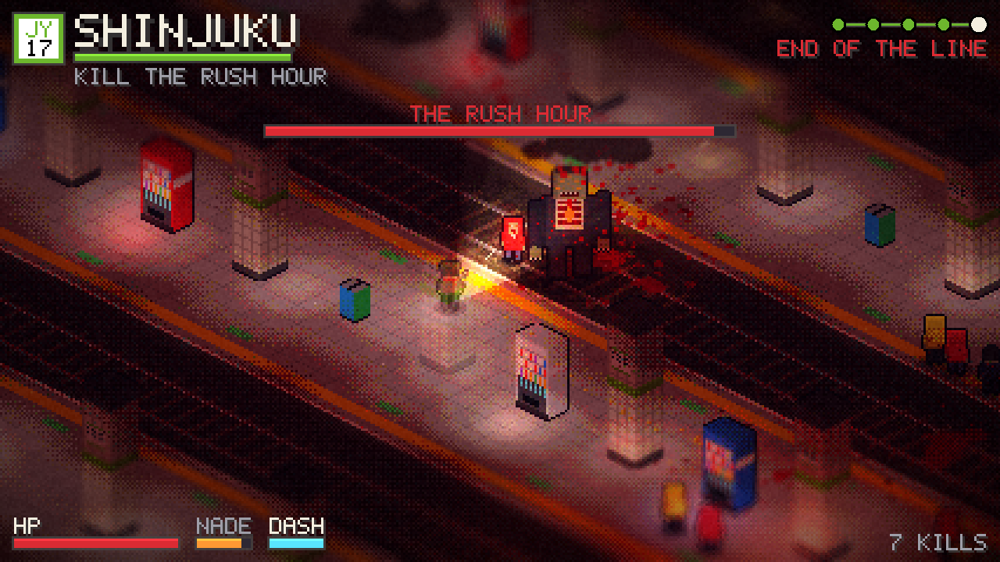
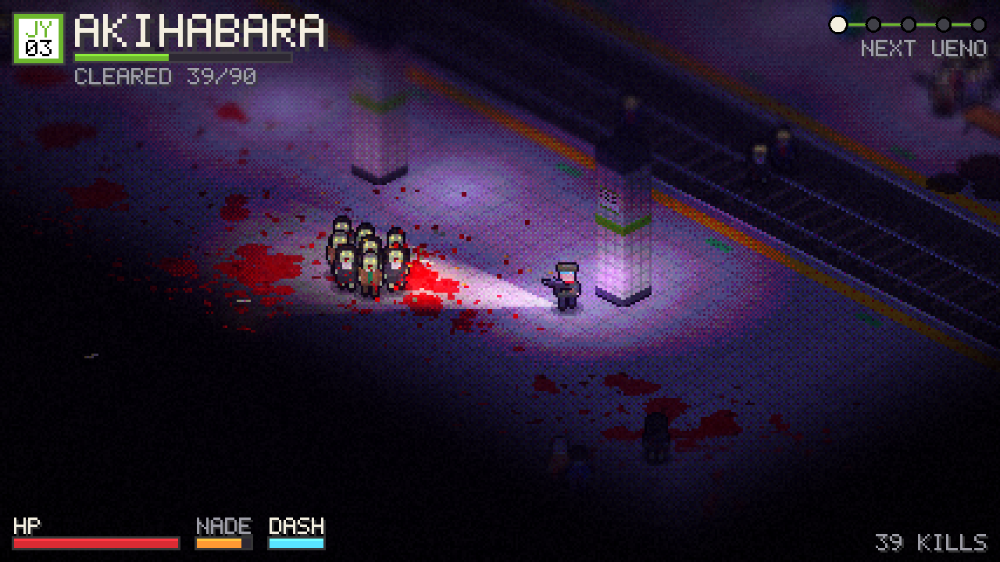
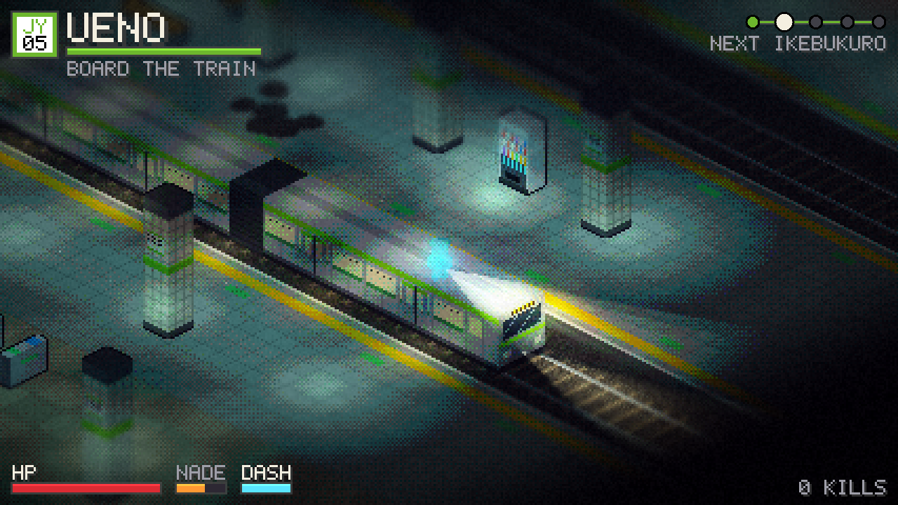
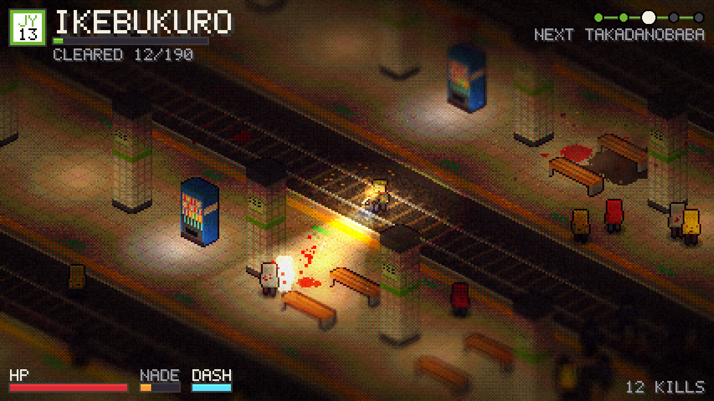

# Last Train to Shinjuku



An isometric twin-stick zombie shooter set in Tokyo's train stations. Clear five
stations up the Yamanote line, from Akihabara to Shinjuku, catch the train between
each one, pick an upgrade, and kill the boss waiting at the end of the line.

**[▶ Play in your browser](https://bananalorian.github.io/shinjuku/)** ·
**[Download for Windows, macOS, Linux](https://github.com/Bananalorian/shinjuku/releases/latest)** ·
[Changelog](CHANGELOG.md)

Everything is generated in code. There are no asset files: the sprites, the font,
the station floors and walls, all the lighting, and every sound effect and music
loop are built when the game starts. Written in Rust on
[macroquad](https://macroquad.rs).

| | |
|---|---|
|  |  |
|  |  |

## The route

| Station | Line code | What's waiting |
|---|---|---|
| Akihabara | JY03 | Neon, walkers, a gentle start |
| Ueno | JY05 | Runners join in; ticket gates on the concourse |
| Ikebukuro | JY13 | Three tracks, amber light, the first brutes |
| Takadanobaba | JY15 | The lights are dying. Stay in the light. |
| Shinjuku | JY17 | The busiest station on Earth, red emergency strobes, and The Rush Hour |

## Controls

| | Keyboard + mouse | Controller | Touch |
|---|---|---|---|
| Move | WASD | left stick | left half of screen (floating stick) |
| Aim + fire | mouse (hold left button) or arrow keys | right stick (fires automatically) | right half of screen (floating stick) |
| Fire with lock-on | | hold RT without the right stick | right stick idle |
| Dash | Space / Shift | A or LB | DASH button |
| Grenade | right click / E / Q | RB or B | NADE button |
| Pause | Esc / P | Start | |
| Mute | M | Back / View | |
| Menus | arrows + Enter, or click | d-pad + A | tap |

Whatever you touched last becomes the active input, and the on-screen hints follow it.
Controllers rumble on hits, explosions, the boss, and the arriving train.

Controllers use [gilrs](https://gitlab.com/gilrs-project/gilrs) on desktop (Xbox,
PlayStation, Switch Pro and most others) and the browser Gamepad API on the web.
In a browser, press any controller button after the page loads; browsers hide
controllers until then.

## How it's made

This game is built in conversation with Claude, one sprint at a time, and every
sprint is a tagged version with notes in the [changelog](CHANGELOG.md). Commits
describe what changed and why.

On every push, GitHub Actions builds the browser version and publishes it to
GitHub Pages, and builds desktop versions for Windows, macOS and Linux. Pushing a
version tag (`v0.4.0`) turns those builds into a GitHub Release with downloads.

## How the look works

Three low-res passes, then a nearest-neighbor upscale (integer scale picked so the
view is roughly 427x240 pixels):

1. **Scene**: the floor is one baked image per station (decals like blood and scorch
   marks get painted straight into it, so gore piles up for the whole fight), then
   depth-sorted sprites, then particles.
2. **Light**: ambient color plus additive light meshes (ceiling lamps, vending machines,
   muzzle flashes, the flashlight cone, train headlights, zombie eyes).
3. **Post**: scene x light with dithered light bands, a tilt-shift blur that is locked to
   the pixel grid and centered on the player, bloom, distance haze, a saturated
   miniature color grade, shockwaves, vignette, damage tint, and grain.

## How the sound works

`synth.rs` builds about 40 sounds at startup from oscillators, filtered noise, FM bells,
and a small reverb, then hands them to macroquad as in-memory WAV files. Highlights:
gunshots (3 variants), flesh hits, wet splats with bubbles, zombie groans shaped by
vowel formants (walkers groan, runners shriek, brutes growl), a two-tone train horn, an
arrival sound with wheel clacks that slow down as the train brakes plus a brake squeal
and air hiss, the two-tone door chime, an original departure-melody jingle when a
station clears, a 100 Hz fluorescent hum (Tokyo's grid is 50 Hz), a 120 bpm D-minor
combat loop, an ambient title loop, and a rail-clack loop for the ride between stations.

Gameplay code never calls audio directly. `world.rs` pushes `Sfx` cues and `audio.rs`
turns them into sounds, so you can retune the mix in one place (`mix()` in `audio.rs`).
To inspect the raw sounds natively, run with `SJ_WAV=1` and they're written to `/tmp/sfx/`.

## Project map

| File | What lives there |
|---|---|
| `src/main.rs` | Scene flow (title, play, upgrade ride, game over, victory) and debug hooks |
| `src/world.rs` | All gameplay: player, zombies, bullets, grenades, particles, train, boss, upgrades |
| `src/level.rs` | Station definitions, baked floor/wall image, props, lights, collision, flow field |
| `src/render.rs` | Render pipeline and GLSL shaders (lighting composite, tilt-shift, bloom, grade) |
| `src/synth.rs` | Procedural audio: every sound effect and music loop, synthesized into WAVs |
| `src/audio.rs` | Plays the bank: variants, throttling, distance falloff, horde groans, loop crossfades |
| `src/art.rs` | Procedural pixel art: characters, props, train, iso box rasterizer, atlas |
| `src/hud.rs` | HUD, upgrade cards, title and end screens |
| `src/input.rs` | Keyboard/mouse, touch twin-sticks, and controller input; picks the active mode |
| `src/pad.rs` | Gamepads: gilrs on desktop, a JS Gamepad API plugin on the web, plus rumble |
| `src/font.rs` | The hand-coded 5x7 pixel font |
| `web/template.html` | Page shell: loader, gamepad plugin, mobile audio unlock |
| `src/util.rs` | Iso projection, hashing, color helpers |

## Tuning knobs

- **Stations**: `stations()` in `level.rs`. Kill quota, horde cap, spawn rate, zombie mix,
  ambient color, lamp color, neon colors, flicker, and the platform/track layout.
- **Upgrades**: `upgrades()` in `world.rs`.
- **Player baseline**: `Stats::default()` in `world.rs`.
- **Sound mix**: `mix()` in `audio.rs` (volume and minimum gap per sound) and the
  loop levels per scene at the top of `Game::frame` in `main.rs`.
- **Shader look**: in `render.rs`, tilt-shift radius is the `3.4` passed in `Fx`,
  saturation is set per scene in `main.rs`, light banding is the `8.0` in `lit()`.

## Building from source (optional)

CI builds everything, so you don't need any of this to play. To build yourself,
install Rust with [rustup](https://rustup.rs) (on Linux also
`sudo apt install libasound2-dev libudev-dev pkg-config`), then:

```sh
# desktop
cargo run --release

# browser: one self-contained HTML file
rustup target add wasm32-unknown-unknown
cargo build --release --target wasm32-unknown-unknown
python3 build_web.py          # -> dist/index.html
```

## Debug hooks (native only)

```sh
SJ_SHOTS=60,300 SJ_STATION=1 SJ_SCENE=train SJ_AUTO=1 cargo run --release
```

Renders scripted frames to `/tmp/sj_<frame>.png` and quits. `SJ_SCENE` can be
`train`, `boss`, `bossnear`, `win`, `dead`, `upgrade`, or `wall`. `SJ_SIZE=844x390`
simulates a phone screen. `SJ_AUTO=1` turns on an autopilot that wanders and shoots.

## Not in yet

One weapon, no stereo panning (macroquad's audio API has volume but not pan),
and no button remapping yet. Natural next sprints: weapon pickups, per-station set
pieces, and an options screen (remapping, volume sliders).
